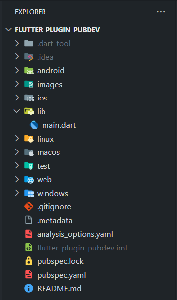
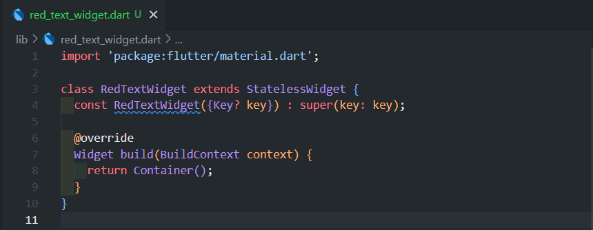
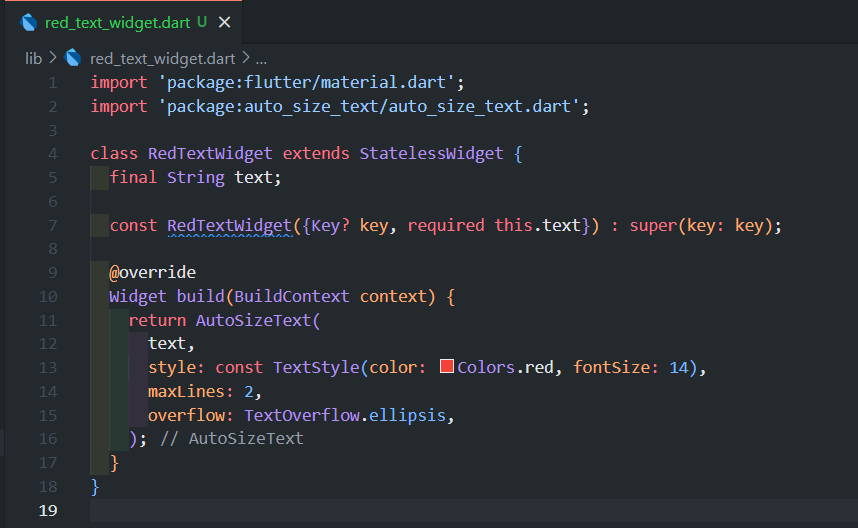
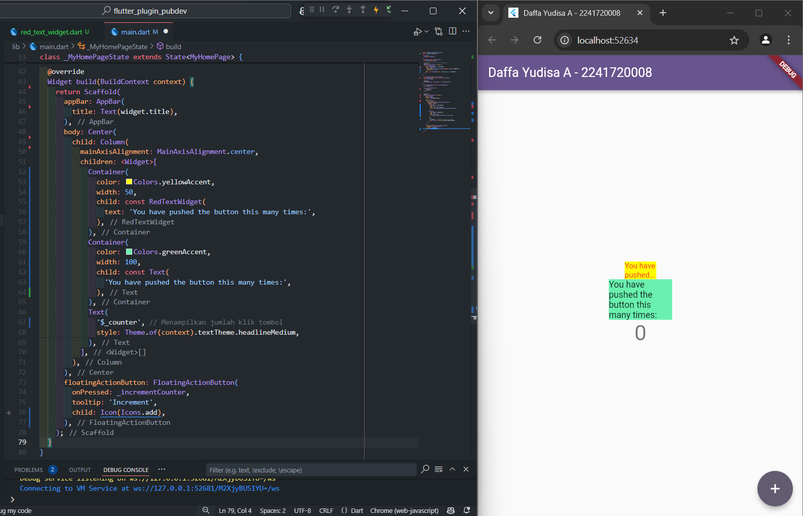

# flutter_plugin_pubdev

A new Flutter project.

---

**Nama : Daffa Yudisa Akbar**

**Kelas : TI-3A / 06**

**NIM : 2241720008**

---

## Tugas Praktikum

1. Selesaikan Praktikum tersebut, lalu dokumentasikan dan push ke repository Anda berupa screenshot hasil pekerjaan beserta penjelasannya di file README.md!

    **Jawab:**

    * Langkah 1:
    
        Pada langkah pertama ini, kita membuat sebuah project flutter dengan nama flutter_plugin_pubdev yang kemudian akan dijadikan repositori di github

        

        ---

    * Langkah 2:

        Pada langkah kedua dilakukan penambahan plugin auto_size_text, yang diinstal melalui terminal. Dengan perintah sebagai berikut:

        ```console
        flutter pub add auto_size_text
        ```

        .png)

        Jika penambahan plugin auto_size_text berhasil, maka akan tampil 
        nama plugin beserta versinya pada file pubspec.yaml pada bagian 
        dependencies, seperti gambar di bawah

        .png)

        ---

    * Langkah 3:

        Pada bagian ini dilakukan pembuatan file baru bernama red_text_widget.dart di dalam folder lib. 

        

        Kode program di atas merupakan sebuah widget stateless dalam 
        framework Flutter yang bernama RedTextWidget. Widget ini 
        didefinisikan dengan menggunakan class RedTextWidget yang mewarisi 
        StatelessWidget. Di dalamnya, terdapat metode build yang 
        mengembalikan sebuah container kosong. Fungsi kode ini adalah 
        untuk mendeklarasikan sebuah widget yang tidak memiliki status 
        (state) dan saat ini tidak menampilkan apapun karena Container() 
        yang digunakan kosong dan tidak memiliki properti tambahan seperti 
        warna, ukuran, atau child. Widget ini bisa digunakan sebagai dasar 
        untuk mengembangkan widget lain, seperti menambahkan teks atau 
        styling di dalamnya.

        ---

    * Langkah 4:

        .png)

        Kode tersebut berada di dalam file red_text_widget.dart dan 
        berfungsi untuk menampilkan teks yang bersifat dinamis menggunakan
        widget AutoSizeText. Widget ini digunakan untuk menampilkan teks 
        secara otomatis dengan menyesuaikan ukuran teks agar sesuai dengan 
        batas ruang yang tersedia. Properti text berisi string yang akan 
        ditampilkan, sementara properti style memberikan gaya pada teks, 
        dalam hal ini menggunakan warna merah dengan ukuran font 14. 
        Selain itu, properti maxLines: 2 membatasi teks untuk ditampilkan 
        maksimal dalam 2 baris, dan overflow: TextOverflow.ellipsis 
        menambahkan tiga titik (...) di akhir teks jika teks melebihi 
        batas baris yang ditentukan. Widget ini memastikan tampilan teks 
        tetap rapi meskipun panjang teks berubah.

        Namun terjadi error seperti gambar di atas.

        .png)

        Hal ini terjadi karena properti text yang digunakan pada widget 
        AutoSizeText belum didefinisikan atau diinisialisasi di dalam class 
        RedTextWidget.

        Widget AutoSizeText memerlukan input berupa teks yang ingin 
        ditampilkan. Dalam kode tersebut, variabel text digunakan 
        untuk menentukan teks yang akan ditampilkan, tetapi variabel 
        ini tidak ada dalam class tersebut, sehingga menyebabkan 
        error undefined name 'text'.

        Serta belum diimportnya plugin auto_size_text juga menyebabkan error tersebut terjadi
        
        Untuk memperbaiki error ini, perlu ditambahkan parameter atau variabel text ke dalam class 
        RedTextWidget. Serta diperlukannya mengimport plugin auto_size_text, seperti kode dibawah ini

        ```dart
        import 'package:auto_size_text/auto_size_text.dart';
        ```

        ---

    * Langkah 5:

        

        Kode tersebut menambahkan variabel text dan parameter di dalam constructor class RedTextWidget, yang memungkinkan widget untuk menerima input teks dari luar. Variabel text didefinisikan sebagai final sehingga nilainya bersifat tetap setelah diinisialisasi. Dengan menambahkan parameter text di constructor, widget ini sekarang dapat menerima teks yang akan ditampilkan saat diinisialisasi. Kata kunci required memastikan bahwa parameter text harus diberikan nilainya ketika widget dipanggil. Konstruktor ini juga meneruskan key ke superclass (StatelessWidget) melalui super(key: key), yang digunakan untuk mengidentifikasi widget secara unik.

        ---

    * Langkah 6:

        

        Kode tersebut menambahkan dua Container dengan warna latar berbeda di dalam class _MyHomePageState pada aplikasi Flutter. Container pertama berwarna kuning terang dengan lebar 50 piksel, dan berisi widget RedTextWidget yang menampilkan teks 'You have pushed the button this many times:' berwarna merah. Container kedua berwarna hijau terang dengan lebar 100 piksel, berisi widget Text standar yang menampilkan teks yang sama tanpa penyesuaian gaya khusus. Kedua container tersebut memperlihatkan perbedaan dalam tampilan teks dengan lebar dan gaya yang berbeda dalam aplikasi.

<br></br>

2. Jelaskan maksud dari langkah 2 pada praktikum tersebut!

    ```console
    flutter pub add auto_size_text 
    ```

    **Jawab:**

    Langkah ini bertujuan untuk menambahkan plugin auto_size_text ke dalam proyek Flutter, yang memungkinkan teks dalam aplikasi menyesuaikan ukurannya secara otomatis agar sesuai dengan ruang yang tersedia. Untuk melakukannya, user harus menjalankan perintah flutter pub add auto_size_text melalui terminal. Perintah ini akan menambahkan plugin tersebut secara otomatis ke file pubspec.yaml, yang berfungsi sebagai daftar dependensi dalam proyek Flutter. Setelah berhasil, nama plugin beserta versinya akan muncul di bagian dependencies dalam file tersebut, menandakan bahwa plugin telah berhasil ditambahkan dan siap digunakan. Dengan adanya plugin ini, user bisa memanfaatkan widget AutoSizeText untuk memastikan teks dalam aplikasi menyesuaikan ukuran tampilannya sesuai batasan layar atau layout yang digunakan.
    
<br></br>

3. Jelaskan maksud dari langkah 5 pada praktikum tersebut!

    ```dart
    final String text;

    const RedTextWidget({Key? key, required this.text}) : super(key: key);  
    ```

    **Jawab:**
    
    Potongan kode ini mendefinisikan variabel dan konstruktor untuk widget kustom RedTextWidget. Pertama, terdapat deklarasi variabel text yang bertipe String dengan kata kunci final, yang menunjukkan bahwa nilai variabel ini hanya dapat ditetapkan sekali dan tidak dapat diubah setelahnya. Variabel ini akan menyimpan teks yang ditampilkan oleh widget. Selanjutnya, terdapat konstruktor const RedTextWidget yang memiliki parameter opsional Key? key dan parameter wajib required this.text. Ini berarti bahwa saat membuat objek dari RedTextWidget, pengguna harus memberikan nilai untuk text, sementara key bersifat opsional dan dapat diabaikan. Dengan menggunakan kata kunci const, konstruktor ini menunjukkan bahwa objek dapat dioptimalkan ketika semua parameternya bersifat tetap. Selain itu, super(key: key) memanggil konstruktor kelas induk StatelessWidget, memastikan pengelolaan status widget dengan benar dalam widget tree Flutter. Secara keseluruhan, potongan kode ini mempersiapkan widget untuk menerima dan menampilkan teks dinamis yang diberikan saat instansiasi.

<br></br>

4. Pada langkah 6 terdapat dua widget yang ditambahkan, jelaskan fungsi dan perbedaannya!
    ```dart
    Container(
    color: Colors.yellowAccent,
    width: 50,
    child: const RedTextWidget(
                text: 'You have pushed the button this many times:',
            ),
    ),
    Container(
        color: Colors.greenAccent,
        width: 100,
        child: const Text(
            'You have pushed the button this many times:',
            ),
    ),
    ```

    **Jawab:**

    Pada langkah 6, dua widget yang ditambahkan ke dalam aplikasi Flutter memiliki fungsi yang sama, yaitu menampilkan teks 'You have pushed the button this many times:', namun dengan perbedaan dari segi tampilan dan fleksibilitas.

    * Container pertama berwarna kuning terang (yellowAccent) dan memiliki lebar 50 piksel. Di dalamnya terdapat widget RedTextWidget, yang merupakan widget kustom yang dirancang menggunakan AutoSizeText. Fungsi dari widget ini adalah menampilkan teks dengan warna merah dan secara otomatis menyesuaikan ukuran teks agar muat dalam batas lebar container (50 piksel), sambil tetap menjaga teks dapat terlihat rapi meskipun ruangnya terbatas. Jika teks terlalu panjang, widget ini akan menampilkan tiga titik di akhir teks (ellipsis).

    * Container kedua berwarna hijau terang (greenAccent) dan memiliki lebar 100 piksel. Di dalamnya terdapat widget Text standar dari Flutter. Fungsi widget ini juga untuk menampilkan teks yang sama, tetapi tanpa penyesuaian otomatis seperti pada AutoSizeText. Jika teks tidak muat dalam lebar container (100 piksel), teks tersebut bisa terpotong atau meluap tanpa modifikasi otomatis, karena widget Text default tidak memiliki fitur pengaturan ukuran otomatis.
    
<br></br>

5. Jelaskan maksud dari tiap parameter yang ada di dalam plugin auto_size_text berdasarkan tautan pada dokumentasi ini (https://pub.dev/documentation/auto_size_text/latest/)!

    **Jawab:**

    * Berikut adalah penjelasan dari tiap parameter yang ada dalam plugin auto_size_text berdasarkan dokumentasi:

    <table>
    <thead>
        <tr>
            <th>Parameter</th>
            <th>Deskripsi</th>
        </tr>
    </thead>
    <tbody>
        <tr>
            <td><code>key</code></td>
            <td>Mengontrol bagaimana satu widget menggantikan widget lain dalam tree Flutter. Ini parameter standar di hampir semua widget untuk mengidentifikasi widget unik.</td>
        </tr>
        <tr>
            <td><code>textKey</code></td>
            <td>Digunakan untuk menetapkan key khusus untuk widget Text yang dihasilkan dari AutoSizeText. Berguna jika Anda ingin mengidentifikasi atau memanipulasi widget Text secara spesifik.</td>
        </tr>
        <tr>
            <td><code>style</code></td>
            <td>Menentukan gaya teks, seperti warna, ukuran font, atau jenis font. Parameter ini sama dengan yang digunakan dalam widget Text biasa.</td>
        </tr>
        <tr>
            <td><code>minFontSize</code></td>
            <td>Ukuran font minimum yang diizinkan ketika teks diresize. Jika tidak ditentukan, default-nya adalah 12. Parameter ini diabaikan jika <code>presetFontSizes</code> diatur.</td>
        </tr>
        <tr>
            <td><code>maxFontSize</code></td>
            <td>Ukuran font maksimum yang diizinkan ketika teks diresize. Berguna untuk membatasi ukuran font meskipun style font-nya besar. Diabaikan jika <code>presetFontSizes</code> digunakan.</td>
        </tr>
        <tr>
            <td><code>stepGranularity</code></td>
            <td>Menentukan seberapa besar ukuran font akan dikurangi pada setiap langkah ketika menyesuaikan ukuran teks. Nilai default-nya biasanya 1, dan nilai yang terlalu kecil bisa mengurangi performa.</td>
        </tr>
        <tr>
            <td><code>presetFontSizes</code></td>
            <td>Menetapkan daftar ukuran font yang diizinkan secara spesifik. Jika <code>presetFontSizes</code> digunakan, parameter <code>minFontSize</code>, <code>maxFontSize</code>, dan <code>stepGranularity</code> akan diabaikan. Daftar ukuran font ini harus dalam urutan menurun.</td>
        </tr>
        <tr>
            <td><code>group</code></td>
            <td>Menyinkronkan ukuran font di antara beberapa AutoSizeText. Teks dalam grup akan menyesuaikan diri dengan ukuran font terkecil dari semua teks di grup tersebut. Parameter ini berguna jika ingin beberapa teks memiliki ukuran font yang seragam dalam batas tertentu.</td>
        </tr>
        <tr>
            <td><code>textAlign</code></td>
            <td>Menentukan bagaimana teks harus diratakan secara horizontal (misalnya kiri, kanan, tengah). Ini adalah parameter umum yang sama dengan yang ada di widget Text.</td>
        </tr>
        <tr>
            <td><code>textDirection</code></td>
            <td>Menentukan arah teks (misalnya, dari kiri ke kanan atau kanan ke kiri). Berguna terutama untuk mendukung bahasa yang berbeda seperti bahasa Arab atau Ibrani.</td>
        </tr>
        <tr>
            <td><code>locale</code></td>
            <td>Digunakan untuk memilih font yang sesuai ketika karakter Unicode yang sama dapat dirender secara berbeda berdasarkan lokal atau budaya.</td>
        </tr>
        <tr>
            <td><code>softWrap</code></td>
            <td>Menentukan apakah teks harus dipisah pada pemisahan baris lunak (soft line breaks). Ini memungkinkan teks untuk memotong dan melanjutkan ke baris berikutnya tanpa memaksakan overflow.</td>
        </tr>
        <tr>
            <td><code>wrapWords</code></td>
            <td>Menentukan apakah kata-kata yang tidak pas di satu baris harus dibungkus ke baris berikutnya. Default-nya adalah true, mirip dengan widget Text biasa.</td>
        </tr>
        <tr>
            <td><code>overflow</code></td>
            <td>Menentukan bagaimana overflow visual harus ditangani, misalnya dengan menggunakan ellipsis untuk menunjukkan bahwa teks dipotong karena tidak cukup ruang.</td>
        </tr>
        <tr>
            <td><code>overflowReplacement</code></td>
            <td>Menyediakan widget pengganti yang akan ditampilkan jika teks meluap dan tidak pas dalam batas yang ada. Parameter ini mencegah teks yang terlalu kecil untuk dibaca.</td>
        </tr>
        <tr>
            <td><code>textScaleFactor</code></td>
            <td>Menentukan jumlah piksel font per piksel logis. Ini juga mempengaruhi <code>minFontSize</code>, <code>maxFontSize</code>, dan <code>presetFontSizes</code>.</td>
        </tr>
        <tr>
            <td><code>maxLines</code></td>
            <td>Menetapkan jumlah maksimum baris untuk teks. Sama seperti dalam widget Text, jika tidak diatur, teks akan mencoba memanfaatkan seluruh ruang yang tersedia.</td>
        </tr>
        <tr>
            <td><code>semanticsLabel</code></td>
            <td>Label semantik alternatif untuk teks, biasanya digunakan untuk mendukung aksesibilitas.</td>
        </tr>
    </tbody>
</table>
    
<br></br>
